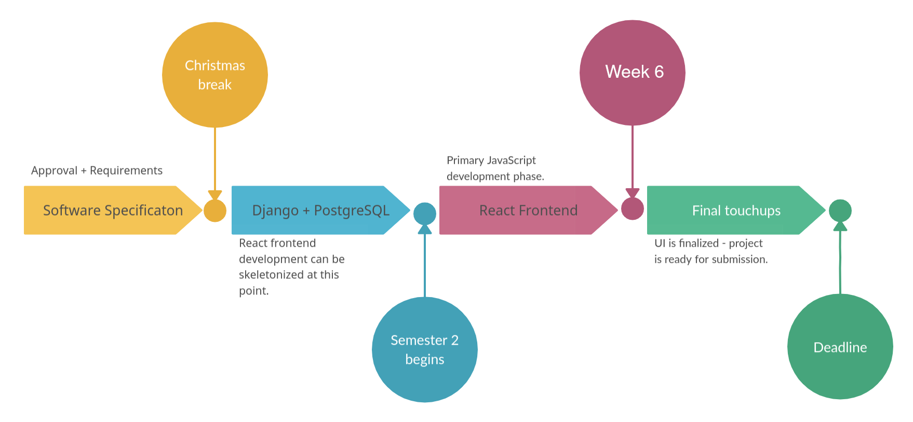

# Software Requirements Specification for Trekster

Prepared by Sam Murphy & Razvan Gorea

Date: 25/11/23

---

## Table of Contents

1. [Introduction](#1-introduction)

2. [Overall Description](#2-overall-description)

3. [External Interface Requirements](#3-external-interface-requirements)

4. [System Features](#4-system-features)

5. [Other Nonfunctional Requirements](#5-other-nonfunctional-requirements)

6. [Other Requirements](#6-other-requirements)
v

7. [Appendix A: Glossary](#appendix-a-glossary)

---

## 1. Introduction

### 1.1 Purpose

Trekster is a full stack project that is being developed. This document contains the specifications and analysis of Trekster. The purpose of Trekster is to allow users to easily discover and access a wide array of hiking trails across Ireland, offering detailed information about each trail's difficulty levels, locations, and unique landmarks.

### 1.2 Product Scope

Our web app, Trekster, is aimed at providing an interactive and engaging platform for hikers and walkers alike, centered around exploring Ireland's diverse and captivating hiking trails. Through user-friendly features and specific trail information, Trekster encourages users to discover and immerse themselves in the natural beauty and adventures that Ireland has to offer.

Our users will access our webapp through their internet browser and can choose to either view all hiking trails or view trails within a specific area or filter by length, altitude, and overall difficulty. Our core goal is to implement an interactive map alongside a sizable database serving **GeoJSON** data to our **ReactJS** frontend webapp. Doing this will involve the use of **Django** and a **PostgreSQL** database, along with various datasets gathered from data provided from the government.

---

## 2. Overall Description

### 2.1 Product Perspective

The product has only one purpose, that is; serving the purpose of helping a user looking to find optimal hiking trails within a specific area. That user can also be curious about the kinds of things they may experience when hiking on that particular trail, for example they may wonder what the weather might be like, or how long the trail will be, or what kinds of landmarks are they going to see along the way, and what kind of terrain they will traverse. These attributes are assigned to these trails inside our database and will be easily displayed to the end user through a filtering system in a highly-interactive clickable user interface.

### 2.2 Product Functions

The major functions the product must perform is:
1. Be a useful tool for those looking to hike.
2. Contain an interactive map.
3. Have trails displayed on that map.
4. Have certain attributes assigned to trails on the map. (E.g., Length, altitude, etc.)
5. Allow the user to filter out trails based on these attributes.
6. Use current weather information to assist the user in their choice of trail/location/timing.

### 2.3 User Characteristics

The users of our product can be catorgorized into three distinct classes:
1. Users looking for hiking trails.
2. Users looking for local landmarks within the area of a trail.
3. Users looking for weather information for specific areas.

### 2.4 Use cases

**Figure 1:** Use Case diagram

### 2.5 **Operating Environment**

The **Operating Environment**s are split into two sections.
1. The server will be hosted on a server running our **Django** REST API and **ReactJS** webapp.
2. A user will access that webapp through their web browser on their personal computer.

---

## 3. External Interface Requirements

### 3.1 User Interfaces

The user will interface with our software through their web browser. A user will be able to use their mouse to drag around the map to view different hiking trails. The user will also be able to click certain elements to filter through hiking trails and find the exact trails that fits their preferences.

### 3.2 Hardware Interfaces

Due to the specific implementation of our webapp. Our user's web browser will run on any internet capable device, so hardware on the user's end is not a factor within this specification.

Despite this, our backend will be hosted on a server so the software/hardware environment on that server device must be configured correctly such that our server runs with no errors. This will require a certain level of processing power and memory to be available to the machine. A modern, multi-core processer along with 2GB of RAM is enough for our server to function in its optimum capacity.

### 3.3 Software Interfaces

Technically speaking, our software is segmented into three different systems:
1. **PostgreSQL** database.
2. **Django** REST API which serves data from previously mentioned database.
3. **ReactJS** server.

This means that our three pieces of software must interface somehow. This is done through API request and JSON data. Specicially **GeoJSON** data which will queried from our database, then served from our API to our React server which will display the map.
---

## 4. System Features

### 4.1 **Development Stack**

**Figure 2:** **Development Stack** diagram

### 4.2 **Data Management**

Data in our system must be managed accordingly:

Storing Data: The system should be able to store **GeoJSON** data in a **PostgreSQL** database.  
Retrieving Data: The system should be able to retrieve **GeoJSON** data from the **PostgreSQL** database. 
Updating Data: The system should be able to patch **GeoJSON** data in the **PostgreSQL** database. 
Deleting Data: The system should be able to remnove **GeoJSON** data from the **PostgreSQL** database.

This data should be then displayed to the end user.

Displaying Data: The system should display **GeoJSON** data to the user through the interactive map.  
Interacting with Data: The system should allow users to interact with the **GeoJSON** data, such as by zooming in and out, selecting different hiking trails, etc.

---

## 5. Other Nonfunctional Requirements

### 5.1 Performance Requirements

* The system needs be able to support many users at once without delay.  
* The system needs to be able to display multiple hiking trails at any given time if a user wishes so.  
* When a user selects a hiking trail, the system should display that hiking trail's information to the user within a quick manner.  
* The **PostgreSQL** database needs to be structured in a way that is efficient and quick to access through queries from the user. To prevent long delays for users, this should be done through having at least two different tables.  
* The **Django** server needs to be able to handle multiple requests from many users at once without delay from the **ReactJS** frontend.  
* The server running **Django**, React and Postgres needs to have 2GBs of memory and a modern processor to handle the load of many users at once at the bare minimum.  
* The client needs to have a modern web browser with an internet connection to access the webapp.

### 5.2 Safety Requirements

While the webapp may utilize user location data for hike trail progression and hike trail recommendations based off an user's proximity, location data will be on a strictly opt-in basis. Their location data will never be stored if they choose to opt-in. The webapp will not use cookies. Hiking Trails that are displayed must be up to date and accurate to prevent any accidents or injuries to users that utilize the product. Hiking Trails that might be dangerous or challenging should be clearly indicated to the user. When a user accesses the webapp initially, the app should present a disclaimer to the user to not go on any hikes if they are fatigued, intoxicated, pregnant, have a physical disability or if the weather is not suitable. 

### 5.3 Security Requirements

* No user data should be stored by the product. User information like IP/Mac Addresses etc, will not be stored or tracked. 
* The React frontend should be the only accessible component of the system to the user.  
* The **PostgreSQL** database should only accept queries from the **Django** backend and reject other external entities. 
* The **Django** backend and the **PostgreSQL** database should not be exposed to the internet. 
* The React frontend should only accept requests from the user's web browser. 
* The **Django** backend should time out users if too many requests are made in a short period of time.  
* The server hosting every system component (React, **Django**, Postgres) needs to be secure. 
* Admins need to utilize an SSH key to gain access to the hosting server. 
* The webapp needs to have a SSL certificate for security.  

### 5.4 Software Quality Attributes

The software must fit certain software quality criteria, some of which include the following:
1. The software must be able to serve the end user in a timely fashion.
2. The software must be accessible and designed with the end user in mind.
3. The software must be compatible with most popular internet browsers (Chrome, Firefox, Opera, Edge, Safari, etc.)
4. The software code must be tidy and readable for future development.
5. The software code should be well commented and well documented.

### 5.5 Data flow

The following figure shows the flow of data to and from external entities to our internal processes and data stores.

**Figure 3:** Data Flow diagram

---

## 6. Other Requirements

### 6.1 Development Timeline

Because our project is part of a group university course core module submission, one of our requirements is that the project must be submitted before the deadline and be up to academic standards of documentation.

**Figure 4:** Development Timeline graph

---

## Appendix A: Glossary

Here are some key terms for understanding this specifications document.

*  **GeoJSON**: A format for encoding geographic data structures. It's used in this project to serve data to the **ReactJS** frontend webapp. 

*  **Django**: A high-level Python web framework that encourages rapid development and clean design. It's used in this project to create the backend of the webapp. 

*  **PostgreSQL**: An open-source relational database management system emphasizing extensibility and SQL compliance. It's used in this project to store **GeoJSON** data. 

*  **ReactJS**: A JavaScript library for building websites. It's used in this project to create the frontend of the web application. 

*  **Development Stack**: The set of technologies used to create a piece of software. For Trekster, the **Development Stack** includes **Django** for the backend, **ReactJS** for the frontend, and **PostgreSQL** for the database. 

*  **Data Management**: The practices, architectural techniques, and tools for achieving consistent access and delivery of data. For Trekster, this involves storing, retrieving, updating, and deleting **GeoJSON** data in the **PostgreSQL** database. 

*  **Operating Environment**: The environment in which the software will operate. For Trekster, this includes the server hosting the **Django** REST API and **ReactJS** webapp, and the user's personal computer accessing the webapp via a web browser.  

---