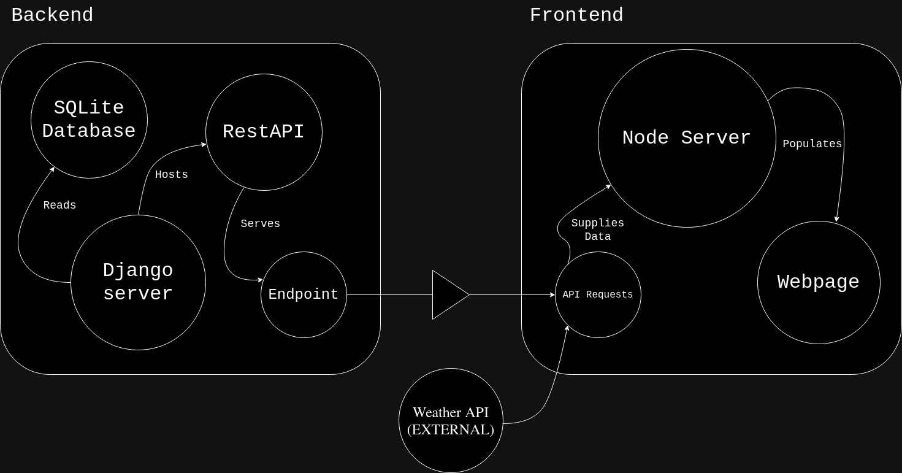
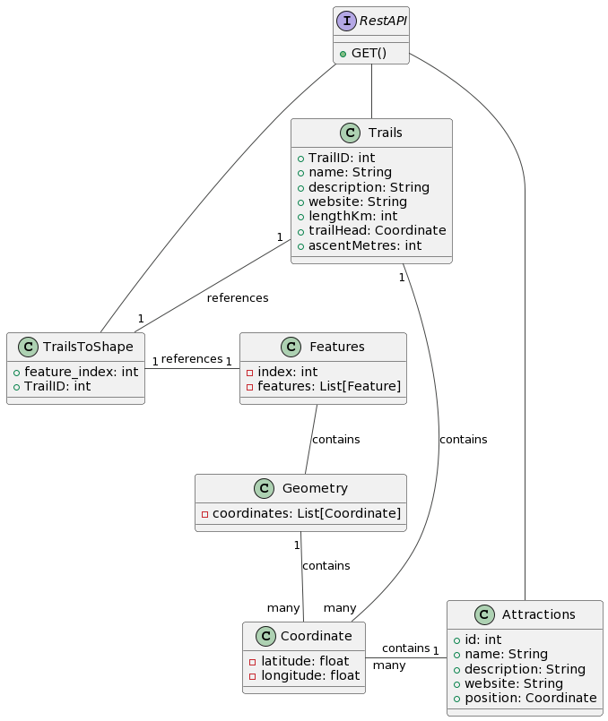

# Technical Manual for Trekster

Prepared by Sam Murphy & Razvan Gorea

Date: 10/02/24

---

## Table of Contents

1. [Introduction](#1-introduction)  
    1.1 [Purpose](#1.1-purpose)  
    1.2 [Product scope](#1.2-scope)  
    1.3 [Glossary](#1.3-glossary)  

2. [Architecture](#2-architecture)  
    2.1 [Architecture diagram](#2.1-diagram)  
    2.2 [Architectural walkthrough](#2.2-walkthrough)  

3. [High level design](#3-high-level-design)  
    3.1 [Description](#3.1-description)  
    3.2 [Class Diagram](#3.2-diagram)  

4. [Problems and Resolutions](#4-problems)  
    4.1 [Problems and Resolutions](#4.1-p-r)  
    4.2 [Project Retrospective](#4.2-retrospective)  

5. [Usage](#5-usage)  
    5.1 [Requirements](#5.1-requirements)  
    5.2 [Installation Guide](#5.2-installation-guide)  

---

## 1. Introduction 

### 1.1 Purpose 

Trekster is a full stack project that is finished development.  
The purpose of Trekster is to allow users to easily discover and access a wide array of hiking trails across Ireland, offering detailed information about each trail's difficulty levels, locations, and unique landmarks.  

### 1.2 Product Scope 

Our web app, Trekster, provides an interactive and engaging platform for hikers and walkers alike, centered around exploring Ireland's diverse and captivating nature trails.  
Through user-friendly features and specific trail information, Trekster encourages users to discover and immerse themselves in the natural beauty and adventures that Ireland has to offer.  
Our users can access our webapp through their internet browser and can choose to either view all trails or search for specific trail, and see important information, such as weather information, length, difficulty level, and description of trail.  
Our unique product implements an interactive map alongside a sizable database serving **JSON** data from various datasets gathered from data provided from the government to our **ReactJS** frontend webapp.  

### 1.3: Glossary 

Here are some key terms for understanding this specifications document.  

*  **Backend**: The part of a software stack that is usually hidden from the user.  

*  **Frontend**: The part of a software stack in which the user interfaces with.  

*  **JSON**: A format for  

*  **Django**: A high-level Python web framework that encourages rapid development and clean design. It's used in this project to create the backend of the webapp.  

*  **SQLite**:  

*  **ReactJS**: A JavaScript library for Node which is used for building websites.  

*  **Foreign key**: Integral to relational databases. Usually in the form of an ID, which is used as a lookup key for a separate table in which matching information exists.  

---

## 2. Architecture 

### 2.1 Diagram 

  
**Figure 1:** **Architecture Diagram**

### 2.2 Walkthrough 

Our project consists of two primary parts, our **backend**, and **frontend** components.  
Our backend consists of an **SQLite3** database, which contains trail and attraction data, which is read by our Django server and served as an endpoint through our RestAPI.  
Our frontend, consists of a Node server which though API requests to both our RestAPI and an external WeatherAPI service, populates our webpage to display our map and its contents to the user.

---

## 3. High Level Design 

### 3.1 Description 

* **Backend:**:  
    As our background is utilising Django, a framework for Python, our backend is written solely in it.  
    In our models.py, we define our two primary models: Trails and Attractions. We then wrote definitions in serializers.py for these models to format the fields from the database to our RestAPI. We then created the corresponding views.py file, and migrated the database.  
    We then tested if the server was reachable on port 3000, and that our RestAPI endpoint was responding to API requests made from the Node server.

* **Frontend:**:  
    Our frontend is written entirely in JavaScript.  
    We are running a Node server and using the React Javascript library for our project.  
    We are also utilising react-leaflet and OpenStreetMap to render our map on our webpage and use its build in components.  
    We have a single webpage, Home.js, along with a few key components.  
    We start with Attractions.js. Its purpose is, as a child of the MapContainer to both fetch the Attractions from our RestAPI using a GET request, and rendering them on the map by using react-leaflet's 'Marker'.  
    We also used 'Popup' to allow the user to click on the marker and have information about that marker shown up.  
    Next we move to Trails.js. This components job is similar to that of Attractions.js. It has three main purposes.
    * 1. To fetch, using a GET request, the trails from our SQLite database.  
    * 2. By using a separate table which links, by use of a **foreign key**, both the trail data and the geometries.json file, which contains each trail's coordinate data.  
    * 3. Then, as a child of the MapContainer, render the trails on the map, along with a marker which is clickable by the user to show trail information.  

    Lastly, is Weather.js. This components job is to render the weather aspect of our webapp. Upon selection of the Irish county, the component makes a GET request to the external WeatherAPI to find the exact forcast for the next few hours for that particular county.  
    When its all put together in our Home.js, the components work together to create an easy to use interactive webpage which allows the user to search and navigate through our large catalogue of trails available.  

### 3.2 Class diagram 

  
**Figure 2:** **Trekster class diagram**

This diagram shows the relation between our models and SQL database.

---

### 4.1 Problems and how we solved them 
* **Problem 1:**
    Our first problem encountered was the issue of data.  
    The Sport Ireland dataset is public, but acquiring all that data in a parsable format was a challenge.  
  * **Solution:**
      We reached out to Sport Ireland directly and they were kind enough to provide a excel sheet with all of our requested data.  
      We also got the shapes of the trails (coordinate arrays) from their featureServer API.  
      There were issues around this data, which we will discuss in a separate problem.  

* **Problem 2:**
    When mapping coordinates from our datasets, all of our markers and polylines appeared in the Indian Ocean instead of over Ireland.  
    This was due to the coordinates being the wrong way around for the functions provided by react-leaflet.  
  * **Solution:**
      A Python script was written to recursively enter the arrays contained within the JSON file and swap the coordinates by remapping them to [coordinates[1], coordinates[0]].  

* **Problem 3:**
    Mapping the trails which coordinates exist in the JSON file was easy, Polyline takes an array of coordinates as an argument but can also take an array of array as coordinates so mapping multi-segmented trails wasnt an issue.  
    However, linking these mapped trails to the database was an issue.  
    The first coordinate of our trail geometry from the JSON array was slightly different than the starting coordinate in the database.  
    There was also no foreign key lookup possible - the two sets of data were different.  
  * **Solution:**
      The solution was to write a Python script which takes both the JSON file and fetches trails from our database.  
      With both of them loaded, rounds the coordinates of each trail head and tries to find a coordinate from the JSON file which matches, then append the TrailID under the index of the array in a csv file.  
      Due to duplication, many trails were omitted from the final project, but we have have kept a robust set of complete data which we used in our map.  

* **Problem 4:**
    One of our final major problems was speed. Our webapp loaded incredibly slowly, if at all.  
    Due to the sheer amount of coordinates (sometimes thousands per trail), iterating, parsing, then mapping by function calls (especially Marker) over that data and each coordinate, is incredibly computationally taxing.  
    Sometimes our webapp would refuse to load, or kick random errors that were due to React components being re-rendered too many times.  
  * **Solution:**
      To solve this, we ended up scrapping a lot of the more data heavy trails, the trails with over a few thousand coordinate pairs.  
      This, along with a lot of data parsing and component optimisation, allowed the webpage to run consistently and responsive enough to not affect the user negatively.  

* **Problem 5:**
    The last problem that we faced was related to an issue with react-leaflet.  
    Because our project was originally heavily componentized, there was an issue with allowing the user to click a trail in the search menu, and have it zoom in to that trail on the map.  
  * **Solution:**
      It doesn't sound like a difficult problem, but this issue eventually drove us to removing many of our components and bulking the main webpage Home.js by a lot.  
      This way we were able to utilise useStates in React which updates the map everytime the map center coordinate was changed, meaning we could have the click event change the variable, and the map would fly to that coordinate defined in the trail data.  

### 4.2 Project Retrospective 
If we were to do this project again, there's a few key things we would do differently/change:
* **Varied data**
    Perhaps we would try different types of data, for example instead of purely walking/hiking/cycling data, we could do bus routes, train routes, flight paths, shipping routes, etc.  
    There is an innumerable amount of different data out there that we could have mapped and centered our project around.  
    We think this way because generally there isn't a huge amount of scope in Ireland for nature trails.  
    There are only so many of them, and the small land area of Ireland means we are not using the full available real estate space an interactive map such as the one we used actually provides us.  
    Basically, we have only explored a small portion of what is possible with this kind of software stack.  

* **Time Management**
    Time management was somewhat of a key issue that we faced.  
    If we did this project again, we would definitely allot more of our limited time to ensuring the end product is complete and looks good.  
    Because of our time constraints, we had less time to style and optimise the UI of our webapp as we would have liked, as we underestimated how much time data gathering and backend work would end up taking.  

Despite this, we believe our end product is more than acceptable, and we are both happy with how it turned out, considering the scope and issues we faced.  
We have learned a lot from this project, and we both hope that in the future the important skills we learned from our time working on this project will carry us into future endeavours.  

---

## 5. Usage 

### 5.1 Requirements 

Our requirements are:
* **Nodejs**
* **Python**

### 5.2 Installation Guide 

1. Clone the repo.
2. Run `cd code/Django` and run `pip install -r requirements.txt`.
3. Then run `python manage.py runserver`.
4. With the Django server running, go back to the root of the repo and run `cd code/React/trekster-app`.
5. Run `npm install`.
6. After dependencies are installed, run `npm start`.
7. A web browser should open with the React App running, but if it doesn't, open `localhost:3000`.

---

