# User Manual For Trekster Hiking Web Application

### Introduction

This is the user manua for the Trekster Interactive Web Application. Information within this user manual will equip the user with the knowledge to use the application with ease. The user manual covers the following:

The following content will be covered in this manual:

[**1. Navigating the Interactive Map**](#1)  
[**2. Hiding & Showing Attractions**](#2)  
[**3. Using the Search Feature**](#3)  
[**4. Accessing Weather Information**](#4)  
[**5. Accessing a Specific Trail**](#5)  
[**6. Hiding & Showing Trails**](#6)  
[**7. Accessing Additional Trail Information**](#7)  
[**8. Accessing Additional Attraction Information**](#8)

---

### _Navigating the Interactive Map_ 

One of the main aspects of this application is the interactive map. When the user first opens the application they will be greeted with a map in the centre of the webpage.

Like so:  

  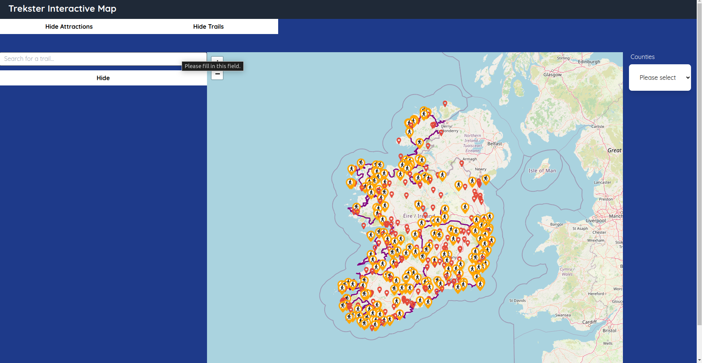

In order to get the most out of this application the user will need to be able to navigate the interactive map. There are two aspects to navigating the interactive map, zooming in and out and panning:

1. **Zooming In & Out**  
   The user can zoom in and out of the map by using the scroll wheel on their mouse. Scrolling up will zoom in and scrolling down will zoom out. Scrolling up on the mouse will zoom in and scrolling down will zoom out. Alternatively, the user can use the zoom in and out buttons in the top left corner of the map.

   The zoom in and out buttons look like this:  
   

2. **Panning**
   The user can pan the map by holding down left mouse button or left click and dragging the map in the direction the user desires. This will move the map in the direction the user drags. Alternatively, the user can use the arrow keys on their keyboard to pan the map in the desired direction, all be it considerablely slower.

---

### _Hiding & Showing Attractions_ 

Attractions are another key feature of this application. Attractions can range from castles to museums and more. Attractions are displayed on the map as red markers.

Example attraction marker:  
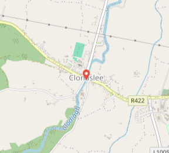

Although the idea of attractions are great, the user may at times want to hide them from the map. This can be done by clicking the `Hide Attractions` button at the top of the map. This will remove all attraction markers from the map. Allowing the user to clean up the map slightly.

The `Hide Attractions` button looks like this:  

When the `Hide Attractions` button is clicked by a user, it will flip its state to `Show Attractions`. If clicked, the user can see the attractions again. The `Show Attractions` button looks like this:

---

### _Using the Search Feature_ 

This section will cover how to use the search feature to display a specific trail on the map. There three types of trails that the interactive map displays:

1. **Walking Trail**

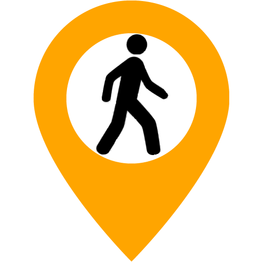

2. **Cycling Trail**

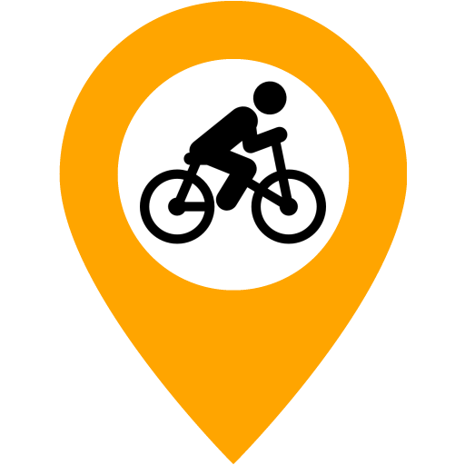

3. **Hiking Trail**

With that out of the way, let's get into how to use the search feature. The search feature is represented by the search bar at the top left of the webpage.

The search bar looks like this:

To search for a specific trail, just type the name of trail into the search bar. It should be noted that the search feature is not case sensitive.

Once a the user supplied a trail, a list of trails will appear as the search result. Each trail has its own button, along with a difficulty rating and trail type (walking, cycling, hiking). The user can click on a trail from the list and the interactive map will zoom in on the trail.

Here is an example of the search feature in action:

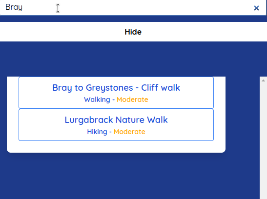

---

### _Accessing Weather Information_ 

Another feature that is present within the application is the ability to access weather information. More specifically for all the counties within the Republic of Ireland. If the user wishes to access weather information for a specific county, they can use the dropdown menu at the top right of the webpage.

The weather dropdown menu (unexpanded) looks like this:

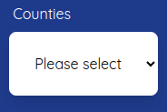

The weather dropdown menu (expanded) looks like this:

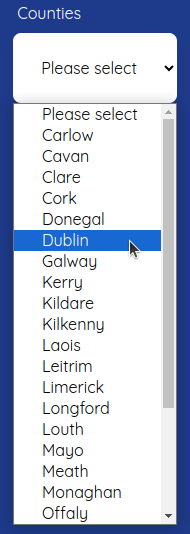

The user can click on a county from the dropdown menu and the weather information for that county will be displayed right under the weather dropmenu menu. The weather information will include temperature, a weather description and wind speed and more. Aswell as a weather forecast for the current day.

Here is how the weather information looks like:

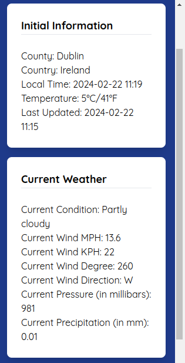

Here is how the weather forecast looks like:

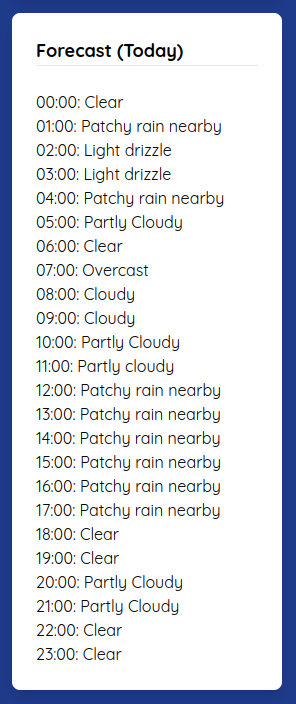

---

### _Accessing a Specific Trail_ 

Building on the [search feature](#3), a user can access a specific trail. Once a user has decided on a trail and has searched for it, the interactive map will zoom in on that specific trail if the user has clicked on its respective button from the search result.

Searching for the Bray to Greystones trail will look like this:

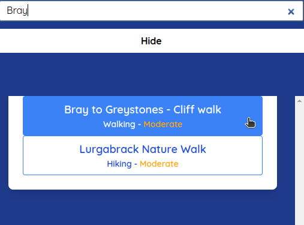

By clicking the `Bray to Greystones - Cliff walk` button, the interactive map will zoom in on this particular trail. The trail will be displayed on the map as a purple line. The trail will also have a yellow marker, marking the beginning. This is the same case for every trail.

Here is how the Bray to Greystones trail looks like:

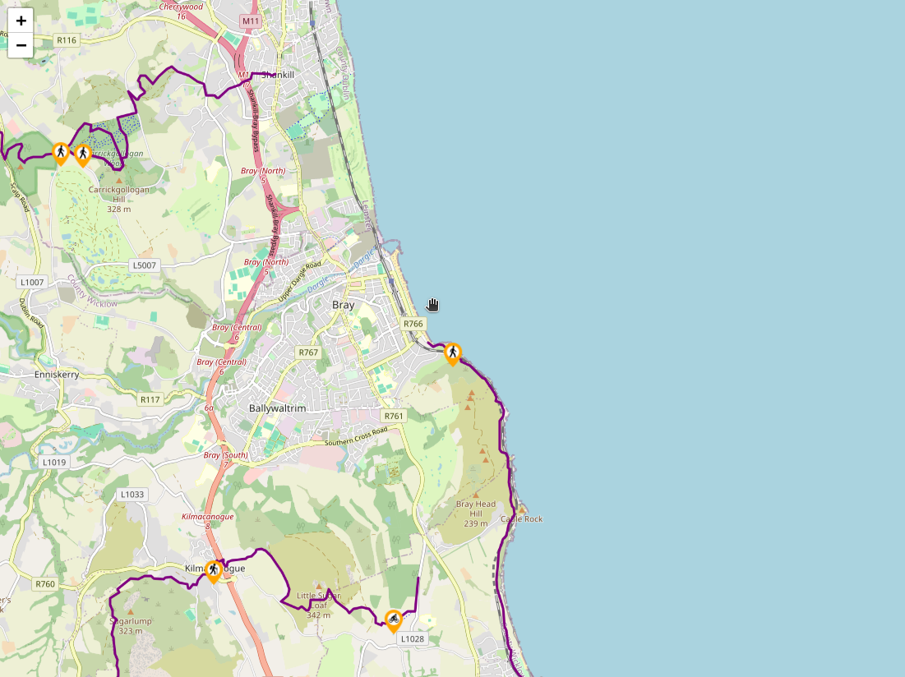

---

### _Hiding & Showing Trails_ 

Just like the [hide attractions feature](#2), the user can also hide trails from the map. This can be done by clicking the `Hide Trails` button at the top of the webpage. This will hide all trail markers aswell as the trails from the map. Allowing the user to toggle the trails on and off.

The `Hide Trails` button looks like this:

---

### _Accessing Additional Trail Information_ 

Since the user can access a [specific trail](#3). It should also be noted that for the benefit of the user, additional information in relation to a trail can be viewed. This can be accomplished by clicking on the yellow trail marker associated with a trail, or by clicking on the trail itself. Once the user carries out this action, a popup will appear with additional information about the trail. This information will include the trail name, trail type, trail distance, trail description and an external link to a relevant online resource.

Trail Popup Example:

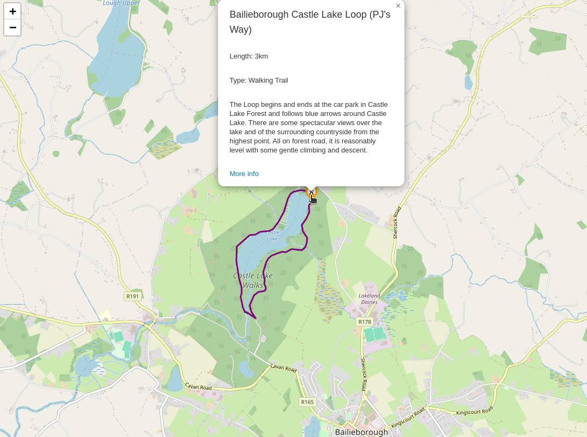

---

### _Accessing Additional Attraction Information_ 

Similar to the [additional trail information](#7), the user can also access additional information in relation to an attraction. This can be accomplished by a user through clicking on a red attraction marker associated. Once the user carries out this action, a popup will appear above the marker. The name of the attraction will appear on within the popup, aswell as a link to an external online resource relevant to the attraction.

Attraction Popup Example:

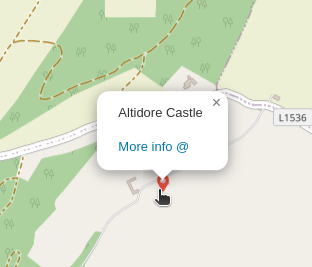
